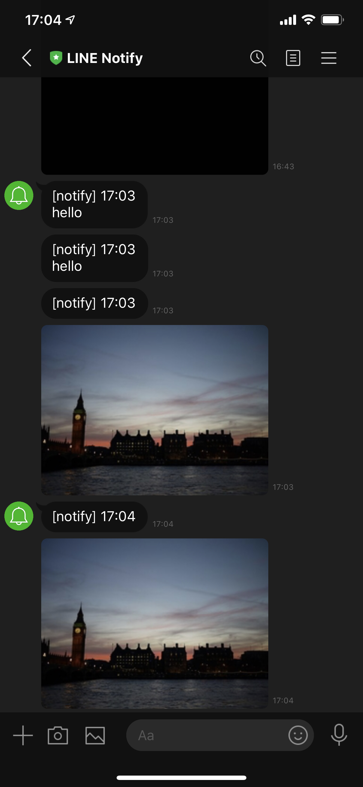

# line-notify

A python library for manipulating line notify api

## Install

```
pip install line-notify
```

## QuickStart

First, get line notify token from https://notify-bot.line.me

```
import line_notify
client = line_notify.LineNotify(token=YOUR_ACCESS_TOKEN)
client.notify('hello')  # send message
client.notify(imgs='./docs/image/london.jpg')  # path of image
```

You can send `PIL.Image.Image`

```
from PIL import Image
pil_img = Image.open('./docs/image/london.jpg')
client.notify(imgs=pil_img)
```

<p align="center">
    
</p>

If the argument of `LineNotify`'s `token` is None, get access token from environment variable `LINENOTIFY_TOKEN`.
